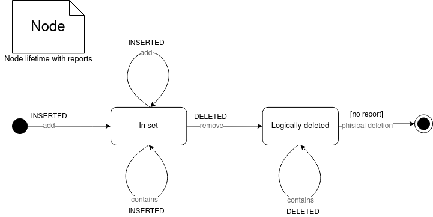

# Scientific-iterator

# Description
On other languages:
[English](README.md)
[Русский](README.ru.md) \
$\qquad$ Disclaimer: This implementation is not related to authors of the article. It was made as a personal study project. I hope, this implementation can help others to understand the algorithm.
$\qquad$ Wait-free snapshot-based iterator for concurrent list. Implemented for lock-free list according to the article.
A lot of comments around the code contain (or consist of) pieces of the article.

$\qquad$It has to me noted, that due to some optimizations, proposed in the article, snapshot scanning relies on internal set implementation: in ScannerStorage.oneTryPutOrdered and in SnapshotManager. This logic could be separated, but it is left as is to be easily understood. In other situations reference to Node is used only as unique identifier.

$\qquad$The main idea of snapshot scanning is the following. When some thread starts taking snapshot, threads, changing set structure are to give snapshot about changes they are making. To provide snapshot consistency, threads should not only report about their own changes, but also to help others do report, before their own actions if:
1. visible changes should be linearized before new actions OR
2. there is a danger for the iterator to not reflect the changes.
This provides snapshot consistency. \
$\qquad$After a single scan of the entire list, received reports are used for snapshot validation.

## Quick implementation overview
$\qquad$The key object in snapshot scanning is SnapCollector. It is responsible for linearization point of the entire scanning. It also collects reports about changes and collect seen nodes from simultaneously iterating threads. \
$\qquad$Report storing is provided by ReportStorage and ScannerStorage. They have similar inner logic, based on renowned concurrent queue of Michael Scott, implemented in Generic Storage. The storing elements are not values, but references to Nodes. It provides a unique identifier, essential for snapshot validation.

$\qquad$SnapshotManager logically separates snapshot scanning from other set operations. Besides it logically marks report operation in implementation. It reflects the action order of snapshot scanning.
# Understanding reports
$\qquad$What makes report approach work? How can it be came up with? Under this header contains an attempt to answer these questions and generalize the idea.

## Visual and simple
Let's take a look to each node lifecycle: \
 \
Uppercase letters denote types of reports.

$\qquad$From the diagram it can be easily recognized, that reports are sent, when some thread found the node in a particular state or when it modifies the state. It means, the thread should make a report of node's state, when the result of his operation depends on the state.

$\qquad$When collected reports being processed during snapshot validation, first, INSERTED nodes are added to seen set, then DELETED nodes are removed from it. As a result, every node appears in it's last state. This process can be easily visualized with state graph. Suppose all reports for given node were separated from all reports and then state reflected by reports were highlighted on the graph. The furthest from initial state highlighted arrow will point to the required state.

In case of a node in lock-free linked list, the state is denoted by mark on AtomicMarkableReference.

## Is something special in this diagram?
What in this diagram enables validation of nodes state by report? Does it have some special structure?

1. Each report type corresponds to exactly one state change (one arrow).
  - INSERTED - in set
  - DELETED - logically deleted
2. The graph has no cycles.
  - Suppose we have a graph which is a cycle and SnapCollector received reports for every state of cycle. Because the order of collected reports is undefined, one can not figure out which state was the last one.

It seems to be enough to find the last state of the node.

## Can cycles be supported?
$\qquad$The most obvious solution is to maintain a number of transformations in node. Reporting such number with a node will reveal not only it's final state, but also a part of its path.

# Sources

- lock-free set algorithm is implemented according to the book \
  Herlihy M., Shavit N. The Art of Multiprocessor Programming (220 - 226)
- iterator algorithm is implemented almost according to the article but with some restrictions. \
  Petrank E., Timnat S. Lock-free data-structure iterators //International Symposium on Distributed Computing. –
  Springer, Berlin, Heidelberg, 2013. – С. 224-238.
  https://link.springer.com/chapter/10.1007/978-3-642-41527-2_16
